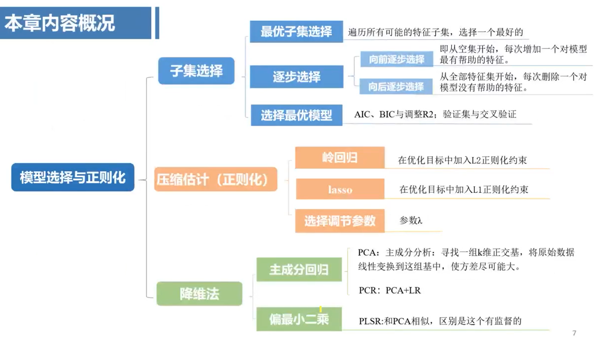
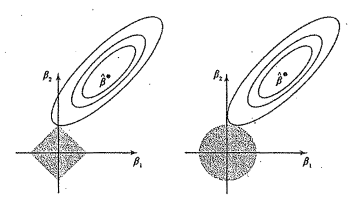

# 第六章 线性模型选择与正则化

采用其他拟合方法替代最小二乘法的原因：其他方法有**更高的预测准确率**，**更好的模型解释力**

**预测准确率**

- 不满足n远大于p，则最小二乘可能过拟合
- 若p>n，最小二乘得到的系数估计结果不唯一，此时方差无穷大，无法使用最小二乘

<u>改进：通过**限制**或**缩减**待估计系数，牺牲偏差的同时显著减小估计量方差</u>

**模型解释力**

- 多元回归模型中，常存在多个变量与响应变量不存在线性关系的情况，增加复杂度却与模型无关
- 去除不相关特征可以得到更容易解释的模型，而最小二乘很难将系数置为0

<u>改进：通过自动进行**特征选择**或**变量选择**，实现对无关变量的筛选</u>

## 子集选择

### 最优子集选择

对于k=1,2,...,p: 拟合$C_p^k$个包含k个预测变量的模型，并且在这$C_p^k$个模型中选择RSS最小或$R^2$最大的模型

然后根据交叉验证预测误差、$C^p(AIC)$、$BIC$或调整$R^2$从这些模型中选一个最优模型

- 缺陷明显：p比较大时不具有计算可行性

### 逐步选择

逐步选择包括**向前逐步选择**和**向后逐步选择**

#### 向前逐步选择

对于k=1,2,...,p: 从p-k个模型中选择（在前一个模型基础上增加一个变量），并且在这p-k个模型中选择RSS最小或$R^2$最大的模型

然后根据交叉验证预测误差、$C^p(AIC)$、$BIC$或调整$R^2$从这些模型中选一个最优模型

#### 后向逐步选择

对于k=p,p-1,...,1: 从k个模型中选择（在前一个模型基础上减少一个变量），并且在这p-k个模型中选择RSS最小或$R^2$最大的模型

然后根据交叉验证预测误差、$C^p(AIC)$、$BIC$或调整$R^2$从这些模型中选一个最优模型

### 选择最优模型的指标

$C_p$、$AIC$、$BIC$和调整$R^2$
$$
C_p=\frac{1}{n}(RSS+2d\hat{σ}^2)
$$

$$
AIC=\frac{1}{n\hat{σ}^2}(RSS+2d\hat{σ}^2)
$$

$$
BIC=\frac{1}{n}(RSS+log(n)d\hat{σ}^2)
$$

$$
调整R^2=1-\frac{RSS/(n-d-1)}{TSS/(n-1)}
$$

## 压缩估计方法

###  岭回归（L2正则化）

与最小二乘相似，但增加了压缩惩罚
$$
\sum_{i=1}^{n}(y_i-β_0-\sum_{j=1}^{p}β_jx_{ij})^2+λ\sum_{j=1}^{p}β_j^2=RSS+λ\sum_{j=1}^{p}β_j^2
$$
λ≥0是调节参数，λ越小光滑度越高，偏差越小方差越大

※ 使用岭回归之前最好先对预测变量进行标准化

### Lasso（L1正则化）

$$
\sum_{i=1}^{n}(y_i-β_0-\sum_{j=1}^{p}β_jx_{ij})^2+λ\sum_{j=1}^{p}|β_j|=RSS+λ\sum_{j=1}^{p}|β_j|
$$

λ≥0是调节参数，λ越小光滑度越高，偏差越小方差越大

### 岭回归和Lasso的等价问题

Lasso回归等价于求解
$$
\mathop{minimize}\limits_{β}\{\sum_{i=1}^{n}(y_i-β_0-\sum_{j=1}^{p}β_ix_{ij})^2\},\sum_{j=1}^{p}|β_j|≤s
$$
岭回归等价于求解
$$
\mathop{minimize}\limits_{β}\{\sum_{i=1}^{n}(y_i-β_0-\sum_{j=1}^{p}β_ix_{ij})^2\},\sum_{j=1}^{p}β_j^2≤s
$$

将上式数形结合表示如图，黑色区域为≤s的区域，椭圆是RSS等高线

### 岭回归和Lasso的贝叶斯解释

岭回归对应高斯分布的密度函数

Lasso对应拉普拉斯分布的密度函数

## 降维方法

### 主成分回归（PCA）

见第十章

### 偏最小二乘（PLS）

偏最小二乘用响应变量Y的信息筛选新变量

## 高维数据的回归问题

拟合并不光滑的最小二乘模型在高维中作用很大：

- 正则或压缩在高维问题中至关重要
- 合适的调节参数对于得到好的预测非常关键
- 测试误差会随着数据维度的增加而增大，除非新增特征变量与响应变量确实相关